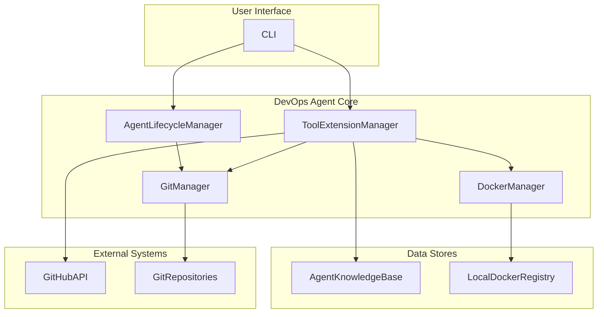

# Product Requirements Document: DevOps Agent v4

**Author**: Manus AI

**Version**: 4.0

**Date**: 2026-03-01

## 1. Introduction

This document outlines the product requirements for the **DevOps Agent v4**, an enhanced version of the autonomous system designed to analyze, manage, and interact with software repositories. This version introduces two major new capabilities inspired by cutting-edge research and open standards in the field of AI agents: **Git-Native Agent Definition** and **Autonomous Tool Extension**.

### 1.1. Problem Statement

While the DevOps Agent has proven effective in managing and automating development workflows, it faces two key limitations:

1.  **Agent Definition is Ad-Hoc**: The definition of an agent's capabilities, personality, and knowledge is not standardized or version-controlled, making it difficult to manage, share, and collaborate on agent development.
2.  **Fixed Toolset**: The agent is limited to its built-in toolset, and cannot dynamically acquire new tools to address novel or specialized user requests. This restricts its adaptability and problem-solving capabilities.

### 1.2. Goals and Objectives

The primary goal of DevOps Agent v4 is to address these limitations by transforming the agent into a more powerful, flexible, and collaborative entity.

**Key Objectives:**

*   **Standardize Agent Definition**: Adopt a git-native, file-based standard for defining agents, enabling version control, collaboration, and CI/CD for agent development.
*   **Enable Autonomous Tool Extension**: Empower the agent to autonomously discover, set up, and utilize external tools from GitHub to fulfill a wider range of user requests.
*   **Enhance Developer Experience**: Provide a streamlined CLI and workflow for creating, managing, and interacting with agents.
*   **Future-Proof the Agent Architecture**: Lay the groundwork for a more dynamic and extensible agent ecosystem.

## 2. Product Vision

DevOps Agent v4 is envisioned as a self-evolving, collaborative partner in the software development lifecycle. It will not only automate workflows but also actively learn and expand its capabilities by leveraging the vast ecosystem of open-source tools on GitHub. By defining agents as code, we will foster a community of agent developers who can share, fork, and improve upon each other's work, creating a virtuous cycle of innovation.

## 3. Target Audience

The target audience for DevOps Agent v4 expands upon the existing user base:

*   **AI Agent Developers**: Individuals and teams who want to build, customize, and share their own AI agents.
*   **Software Developers**: To leverage a wider range of automated capabilities and receive assistance with more complex and specialized tasks.
*   **DevOps Engineers**: To automate even more of the development and deployment pipeline by integrating a vast array of external tools.
*   **Researchers**: To experiment with and advance the state-of-the-art in autonomous agents and tool use.

## 4. Product Features

DevOps Agent v4 will introduce the following new features, organized into two main epics.

### 4.1. Git-Native Agent Definition

This feature introduces a standardized, file-based system for defining agents within a git repository, inspired by the GitAgent.sh open standard. This approach enables version control, collaboration, and CI/CD for agent development.

| Epic | User Story | Acceptance Criteria |
| :--- | :--- | :--- |
| **Agent Definition as Code** | Define agent configuration in a YAML file | - A `agent.yaml` file is created at the root of the agent repository.<br>- The `agent.yaml` file contains fields for `spec_version`, `name`, `version`, `description`, `author`, `license`, and `model` configuration.<br>- The `model` configuration includes `preferred` and `fallback` models, and `constraints` like `temperature` and `max_tokens`. |
| | Define agent's soul in a Markdown file | - A `SOUL.md` file is created at the root of the agent repository.<br>- The `SOUL.md` file contains sections for the agent's `persona`, `mission`, and `values`. |
| | Define agent skills as modular components | - A `skills/` directory is created in the agent repository.<br>- Each skill is defined in a `SKILL.md` file within its own subdirectory inside `skills/`.<br>- The `SKILL.md` file contains metadata such as `name`, `description`, `license`, `compatibility`, and `allowed-tools`. |
| **Agent Lifecycle Management** | Initialize a new agent repository from a template | - A `devops-agent init` command is available.<br>- The command accepts a `--template` flag with options like `minimal`, `standard`, and `full`.<br>- The command scaffolds a new agent repository with the corresponding file structure based on the selected template. |
| | Validate an agent's definition | - A `devops-agent validate` command is available.<br>- The command checks for the presence and correctness of `agent.yaml`, `SOUL.md`, and `skills/`.<br>- The command returns a success message if the validation passes, and a list of errors if it fails. |
| | Run an agent from a repository | - A `devops-agent run` command is available.<br>- The command accepts a `-r` flag to specify the git repository URL.<br>- The command clones the repository, reads the agent definition, and starts the agent. |
| | Export an agent definition to other frameworks | - A `devops-agent export` command is available.<br>- The command accepts a `--format` flag with options like `claude-code`, `openai`, `crewai`, etc.<br>- The command generates the corresponding configuration file for the selected framework. |
| **Agent Collaboration and Versioning** | Version agent definitions using git | - All agent definition files (`agent.yaml`, `SOUL.md`, `skills/`, etc.) are stored in a git repository.<br>- Changes to the agent definition are committed to the repository with descriptive messages.<br>- Standard git commands (`git commit`, `git push`, `git pull`, `git checkout`) are used to manage the agent's definition. |
| | Use branches for agent development and deployment | - A `develop` branch is used for ongoing development.<br>- A `staging` branch is used for testing and pre-production validation.<br>- A `main` branch is used for the production-ready agent.<br>- Changes are promoted from `develop` to `staging` to `main` using pull requests. |

### 4.2. Autonomous Tool Extension

This feature empowers the agent to autonomously discover, set up, and utilize external tools from GitHub repositories to fulfill user requests, inspired by the research paper 'GitAgent: Facilitating Autonomous Agent with GitHub by Tool Extension'.

| Epic | User Story | Acceptance Criteria |
| :--- | :--- | :--- |
| **Tool Discovery and Setup** | Search for suitable tools on GitHub | - The agent can use the GitHub API to search for repositories based on keywords extracted from the user query.<br>- The agent can analyze the README files of search results to determine the suitability of a repository.<br>- The agent can select the most promising repository to proceed with. |
| | Set up the environment for a selected tool | - The agent can clone the selected repository into an isolated environment (e.g., a Docker container).<br>- The agent can parse the README file to find and execute setup instructions (e.g., installing dependencies).<br>- The agent can handle and troubleshoot common setup errors. |
| | Learn from GitHub Issues and PRs to resolve setup problems | - The agent can summarize the setup problem into a search query.<br>- The agent can use the GitHub API to search for relevant Issues and PRs.<br>- The agent can analyze the content of Issues and PRs to find a solution.<br>- The agent can apply the solution to fix the setup problem (e.g., by modifying a file). |
| **Tool Application and Storage** | Apply the configured tool to fulfill the user request | - The agent can identify the correct way to use the tool based on its README file or by learning from GitHub Issues.<br>- The agent can execute the tool with the necessary parameters to get the desired output.<br>- The agent can process the output of the tool to provide a final answer to the user. |
| | Store the configured tool for future use | - The agent can save the configured environment of the tool (e.g., as a Docker image).<br>- The agent can create a functional description of the tool and a summary of the experience of using it.<br>- The agent can store this information in a knowledge base for future retrieval. |
| | Retrieve and reuse stored tools | - The agent can search its knowledge base of stored tools based on the user query.<br>- If a suitable tool is found, the agent can load its configured environment and apply it directly.<br>- This process should be faster than searching and setting up a new tool from GitHub. |

## 5. Non-Functional Requirements

### 5.1. Performance

*   **NFR-1.1**: Initializing a new agent from a template should complete within 10 seconds.
*   **NFR-1.2**: Validating an agent definition should complete within 5 seconds.
*   **NFR-1.3**: The overhead of the agent framework should not add more than 10% to the execution time of an external tool.

### 5.2. Scalability

*   **NFR-2.1**: The system must be able to manage at least 100 stored tools.
*   **NFR-2.2**: The system must be able to handle repositories up to 1GB in size for tool extension.

### 5.3. Security

*   **NFR-3.1**: All external tools discovered from GitHub must be run in a sandboxed environment (e.g., Docker container) with no access to the host system.
*   **NFR-3.2**: The agent must not store any secrets or API keys in the agent definition files. These should be managed through a separate, secure mechanism.
*   **NFR-3.3**: The agent must request user permission before executing any command from a discovered tool that could have side effects (e.g., writing files, making network requests).

### 5.4. Usability

*   **NFR-4.1**: The CLI for managing agents should be intuitive and well-documented.
*   **NFR-4.2**: The agent definition files should be easy to read, write, and understand.
*   **NFR-4.3**: Error messages should be clear and provide actionable feedback.

## 6. Assumptions and Dependencies

*   The system assumes the user has a GitHub account and is familiar with basic git concepts.
*   The system depends on the availability of the GitHub API for searching and retrieving repositories, issues, and pull requests.
*   The system depends on Docker for sandboxing external tools.
*   The accuracy and effectiveness of the autonomous tool extension feature are dependent on the quality of the documentation and code in the target GitHub repositories.

## 7. Future Scope

*   **Interactive Agent Development**: An interactive environment for developing, testing, and debugging agents in real-time.
*   **Agent and Skill Marketplace**: A centralized marketplace for discovering, sharing, and collaborating on agents and skills.
*   **Advanced Learning from GitHub**: More sophisticated techniques for learning from GitHub Issues and PRs, including learning from code changes and discussions.
*   **Support for Other VCS**: Support for other version control systems besides Git, such as GitLab and Bitbucket.
*   **GUI for Agent Management**: A graphical user interface for managing agents, in addition to the CLI.

## 5. Data Model and Storage

### 5.1. Data Model

The data model for the DevOps Agent v4 is designed to support the Git-Native Agent Definition and Autonomous Tool Extension features. It consists of the following main entities:

#### 5.1.1. Agent Definition

This entity represents the definition of an agent, as stored in a git repository.

- **agent.yaml**: Stores the core configuration of the agent.
- **SOUL.md**: Stores the agent's persona, mission, and values as Markdown text.
- **skills/**: A directory containing subdirectories for each skill. Each skill subdirectory contains a `SKILL.md` file with the skill's definition.

#### 5.1.2. Stored Tool

This entity represents an external tool that has been successfully discovered, set up, and used by the agent.

- **tool_id**: A unique identifier for the tool.
- **repository_url**: The URL of the tool's GitHub repository.
- **docker_image**: The name of the Docker image containing the tool's configured environment.
- **function_description**: A summary of the tool's functionality.
- **usage_experience**: A summary of the agent's experience using the tool, including any fixes or workarounds.
- **last_used**: Timestamp.

### 5.2. Storage Strategy

#### 5.2.1. Agent Definitions

Agent definitions are stored in git repositories, as per the Git-Native Agent Definition feature. The DevOps Agent will interact with these repositories using standard git commands.

#### 5.2.2. Stored Tools

Stored tools will be managed in a local knowledge base, which will consist of:

- **A local database (e.g., SQLite)**: To store the metadata of the stored tools (tool_id, repository_url, function_description, usage_experience, last_used).
- **A local Docker registry**: To store the Docker images of the configured tool environments.

This approach will allow the agent to quickly search for and retrieve stored tools without needing to access the network or go through the setup process again.

## 6. Success Criteria & Metrics

### 6.1. Git-Native Agent Definition

#### 6.1.1. Primary Metric

- **Agent Adoption Rate**: The number of new agent repositories created per week.
    - **Baseline**: 0
    - **Target**: 10 new agent repositories per week within 3 months of launch.

#### 6.1.2. Secondary Metrics

- **Agent Validation Success Rate**: The percentage of `devops-agent validate` commands that return a success message.
    - **Baseline**: N/A
    - **Target**: 95%
- **Agent Run Success Rate**: The percentage of `devops-agent run` commands that successfully start an agent.
    - **Baseline**: N/A
    - **Target**: 98%
- **Community Contribution**: The number of pull requests to public agent repositories from community members.
    - **Baseline**: 0
    - **Target**: 5 community PRs per month within 6 months of launch.

### 6.2. Autonomous Tool Extension

#### 6.2.1. Primary Metric

- **Tool Extension Success Rate**: The percentage of user requests requiring a new tool that are successfully fulfilled by the agent.
    - **Baseline**: 0%
    - **Target**: 60% success rate on a benchmark of 50 diverse user queries.

#### 6.2.2. Secondary Metrics

- **Tool Search Accuracy**: The percentage of times the agent selects a suitable repository in the first attempt.
    - **Baseline**: N/A
    - **Target**: 80%
- **Tool Setup Automation Rate**: The percentage of tool setups that are completed without any manual intervention.
    - **Baseline**: N/A
    - **Target**: 70%
- **Stored Tool Reusability**: The percentage of user requests that are fulfilled using a stored tool.
    - **Baseline**: 0%
    - **Target**: 30% of requests that can be fulfilled by a stored tool are fulfilled that way.
- **Average Tool Extension Time**: The average time it takes for the agent to discover, set up, and apply a new tool.
    - **Baseline**: N/A
    - **Target**: Under 15 minutes.

## 7. Architecture & System Design

### 7.1. High-Level Architecture

The DevOps Agent v4 architecture is designed to be modular and extensible. It consists of the following main components:



### 7.2. Component Responsibilities

- **CLI**: The command-line interface for users to interact with the DevOps Agent.
- **AgentLifecycleManager**: Manages the lifecycle of agents defined using the Git-Native Agent Definition standard (init, validate, run, export).
- **ToolExtensionManager**: Manages the process of autonomously discovering, setting up, applying, and storing external tools from GitHub.
- **GitManager**: Handles all interactions with git repositories, including cloning, committing, and pushing.
- **DockerManager**: Manages Docker containers for sandboxing external tools and storing their configured environments.
- **AgentKnowledgeBase**: A local database (e.g., SQLite) that stores metadata about stored tools.
- **LocalDockerRegistry**: A local Docker registry to store the Docker images of configured tool environments.
- **GitHubAPI**: The interface for interacting with the GitHub API to search for repositories, issues, and pull requests.
- **GitRepositories**: The remote git repositories where agent definitions and external tools are stored.

### 7.3. Technology Selections

- **Programming Language**: Python 3.11
- **CLI Framework**: Typer
- **Database**: SQLite
- **Containerization**: Docker
- **GitHub API Library**: PyGithub

## 8. Risk Analysis & Mitigation

### 8.1. Technical Risks

| Risk | Likelihood | Impact | Mitigation |
| :--- | :--- | :--- | :--- |
| **GitHub API Rate Limiting** | Medium | High | Implement caching and exponential backoff for GitHub API requests. |
| **Inaccurate Tool Selection** | Medium | Medium | Improve the agent's ability to analyze README files and use a multi-step verification process before selecting a tool. |
| **Tool Setup Failures** | High | Medium | Enhance the agent's ability to learn from GitHub Issues and PRs, and provide a mechanism for users to manually intervene and guide the setup process. |
| **Security Vulnerabilities in External Tools** | Medium | High | Run all external tools in a sandboxed Docker container with restricted permissions. Implement a security scanner to analyze the code of external tools before execution. |

### 8.2. Business Risks

| Risk | Likelihood | Impact | Mitigation |
| :--- | :--- | :--- | :--- |
| **Low Adoption of Git-Native Agent Definition** | Medium | Medium | Provide comprehensive documentation, tutorials, and examples to make it easy for users to adopt the new standard. Foster a community around agent development to encourage collaboration and sharing. |
| **Competition from Other Agent Frameworks** | High | Medium | Focus on the unique value proposition of the DevOps Agent, such as its deep integration with git and its autonomous tool extension capabilities. Continuously innovate and improve the agent based on user feedback. |

### 8.3. Dependency Risks

| Risk | Likelihood | Impact | Mitigation |
| :--- | :--- | :--- | :--- |
| **Changes to GitHub API** | Low | High | Stay up-to-date with the GitHub API documentation and have a plan in place to quickly adapt to any changes. |
| **Deprecation of Key Dependencies** | Low | Medium | Regularly review and update the agent's dependencies. Have a process for replacing deprecated libraries with alternatives. |

## 9. Timeline & Phasing

The project will be delivered in two main phases:

*   **Phase 1: Git-Native Agent Definition (6 weeks)**
    *   **Week 1-2**: Implement the `agent.yaml`, `SOUL.md`, and `skills/` structure. Implement the `devops-agent validate` command.
    *   **Week 3-4**: Implement the `devops-agent init` and `devops-agent run` commands.
    *   **Week 5-6**: Implement the `devops-agent export` command and write comprehensive documentation.

*   **Phase 2: Autonomous Tool Extension (8 weeks)**
    *   **Week 1-2**: Implement the tool discovery mechanism using the GitHub API.
    *   **Week 3-4**: Implement the tool setup mechanism using Docker and the ability to learn from README files.
    *   **Week 5-6**: Implement the self-correction mechanism by learning from GitHub Issues and PRs.
    *   **Week 7-8**: Implement the tool application and storage mechanism, and conduct thorough testing.

### 9.1. Resource Estimation

*   **Engineering**: 2 Senior Software Engineers
*   **Product Management**: 1 Product Manager
*   **QA**: 1 QA Engineer

### 9.2. Milestones

*   **Milestone 1 (End of Week 6)**: Phase 1 (Git-Native Agent Definition) is complete and ready for internal alpha testing.
*   **Milestone 2 (End of Week 14)**: Phase 2 (Autonomous Tool Extension) is complete and ready for a private beta release.
*   **Milestone 3 (End of Week 16)**: Public release of DevOps Agent v4.

## 10. Testing Strategy

### 10.1. Unit Tests

- **Git-Native Agent Definition**:
    - Test the parsing and validation of `agent.yaml`, `SOUL.md`, and `SKILL.md` files with various valid and invalid inputs.
    - Test the CLI commands (`init`, `validate`, `run`, `export`) with mock data and assert that they produce the expected output.
- **Autonomous Tool Extension**:
    - Test the GitHub search queries with different keywords and verify that they return the expected results.
    - Test the README parsing logic with different README formats and ensure that it can correctly extract setup instructions.
    - Test the issue analysis logic with mock GitHub issues and verify that it can correctly identify solutions to common setup problems.

### 10.2. Integration Tests

- Test the interaction between the `AgentLifecycleManager` and the `GitManager` by cloning a real git repository and running an agent from it.
- Test the interaction between the `ToolExtensionManager`, `GitManager`, `DockerManager`, and `GitHubAPI` by performing a full tool extension cycle with a test repository on GitHub.
- Test the agent's ability to store and retrieve tools from the local knowledge base and Docker registry.

### 10.3. End-to-End Tests

- Create a sample agent repository with a simple skill and use the `devops-agent` CLI to initialize, validate, run, and export it. Verify that the agent behaves as expected.
- Provide the agent with a user query that requires a new tool. The test will involve a dedicated test repository on GitHub with a simple tool. Verify that the agent can successfully discover, set up, apply, and store the tool, and provide the correct answer to the user.

### 10.4. Performance Tests

- Measure the time it takes to initialize, validate, and run an agent with different numbers of skills.
- Measure the time it takes to extend a new tool, from discovery to application.
- Load test the system with multiple concurrent users and agents to ensure that it can handle the expected load and meets the performance NFRs.

## 11. Reliability & Operations

### 11.1. Failure Modes and Recovery

| Component | Failure Mode | Recovery |
| :--- | :--- | :--- |
| **GitHub API** | Unavailable | The agent will use cached data if available. If not, it will inform the user that it cannot connect to GitHub and will retry after a specified backoff period. |
| **Docker Daemon** | Not running | The agent will detect that the Docker daemon is not running and will instruct the user on how to start it. |
| **External Tool** | Fails to execute | The agent will capture the error message and search for a solution in the tool's GitHub Issues. If no solution is found, it will inform the user of the failure and provide the error message for debugging. |

### 11.2. Health Checks

- A `devops-agent status` command will be available to check the status of the agent and its dependencies (Docker, GitHub API connectivity).
- The agent will perform a self-check on startup to ensure that all its components are working correctly.

### 11.3. Monitoring & Alerting

- The agent will log all its activities to a local log file.
- The agent will be integrated with a monitoring system (e.g., Prometheus) to track key metrics such as agent adoption rate, tool extension success rate, and performance.
- Alerts will be configured to notify the development team of any critical errors or performance degradation.

### 11.4. Deployment Strategy

- The DevOps Agent will be released as a Python package on PyPI.
- New versions will be deployed using a rolling update strategy to minimize downtime.
- A rollback plan will be in place to quickly revert to the previous version in case of any issues.

## 12. API Design

### 12.1. CLI API

#### 12.1.1. `devops-agent init`

**Description**: Initialize a new agent repository from a template.

**Usage**:
```
devops-agent init [--template <template>] [--name <name>]
```

**Arguments**:
*   `--template`: The template to use for the new agent. Options: `minimal`, `standard`, `full`. Default: `standard`.
*   `--name`: The name of the new agent. If not provided, the user will be prompted to enter a name.

#### 12.1.2. `devops-agent validate`

**Description**: Validate an agent's definition against the spec.

**Usage**:
```
devops-agent validate
```

#### 12.1.3. `devops-agent run`

**Description**: Run an agent from a repository.

**Usage**:
```
devops-agent run [-r <repository>]
```

**Arguments**:
*   `-r, --repository`: The git repository URL or local path of the agent to run. Default: current directory.

#### 12.1.4. `devops-agent export`

**Description**: Export an agent's definition to other frameworks.

**Usage**:
```
devops-agent export [--format <format>]
```

**Arguments**:
*   `--format`: The format to export the agent to. Options: `claude-code`, `openai`, `crewai`.

#### 12.1.5. `devops-agent status`

**Description**: Check the status of the agent and its dependencies.

**Usage**:
```
devops-agent status
```

## 13. Security Model

### 13.1. Authentication

- **User Authentication**: Users will authenticate with the DevOps Agent using their GitHub account via OAuth.
- **Agent Authentication**: Agents will authenticate with the GitHub API using a GitHub App installation token.

### 13.2. Authorization

- **User Authorization**: Users will only be able to access and manage agents in repositories they have at least read access to.
- **Agent Authorization**: The agent will have the following permissions to the repositories it is installed on:
    - Read access to code and metadata.
    - Read and write access to issues and pull requests.

### 13.3. Sandboxing

- All external tools will be run in a sandboxed Docker container with no network access by default.
- If a tool requires network access, the user will be prompted for permission before the container is started with network access enabled.
- The agent will use a dedicated, non-root user inside the Docker container to run the tool.

### 13.4. Secrets Management

- The agent will not store any secrets or API keys in the agent definition files.
- Any secrets required by an agent or a tool will be managed through a separate, secure mechanism, such as a dedicated secrets management service (e.g., HashiCorp Vault) or environment variables.

### 13.5. Security Scanning

- The agent will integrate with a security scanner (e.g., Trivy) to scan the code of external tools for known vulnerabilities before execution.
- If any vulnerabilities are found, the user will be warned and asked for confirmation before proceeding.

## 14. Migration & Backward Compatibility

### 14.1. Backward Compatibility

The DevOps Agent v4 is a major version update and will **not** be backward compatible with previous versions. The introduction of the Git-Native Agent Definition represents a fundamental shift in how agents are defined and managed. Users upgrading to v4 will need to migrate their existing agent configurations to the new format.

### 14.2. Migration Path

To facilitate the transition to v4, a migration script will be provided. This script will help users convert their existing agent configurations into the new Git-Native Agent Definition format.

#### 14.2.1. Migration Script

**Command**: `devops-agent migrate`

**Functionality**:

*   The script will read the existing agent configuration (e.g., from a proprietary format or database).
*   It will generate the corresponding `agent.yaml`, `SOUL.md`, and `skills/` directory structure.
*   The script will attempt to map the old configuration to the new format as accurately as possible, and will flag any fields or settings that could not be migrated automatically.

### 14.3. Feature Flags

The Autonomous Tool Extension feature will be introduced with a feature flag to allow for a controlled rollout and to gather feedback before making it generally available.

*   **Feature Flag**: `DEVOP_AGENT_ENABLE_TOOL_EXTENSION`
*   **Default**: `false`
*   **Enablement**: The feature can be enabled by setting the environment variable `DEVOP_AGENT_ENABLE_TOOL_EXTENSION=true`.

### 14.4. Data Migration

Since the stored tools knowledge base is a new feature in v4, there is no data migration required for the initial release. In the event of future schema changes to the knowledge base, a data migration script will be provided to update the local SQLite database.
